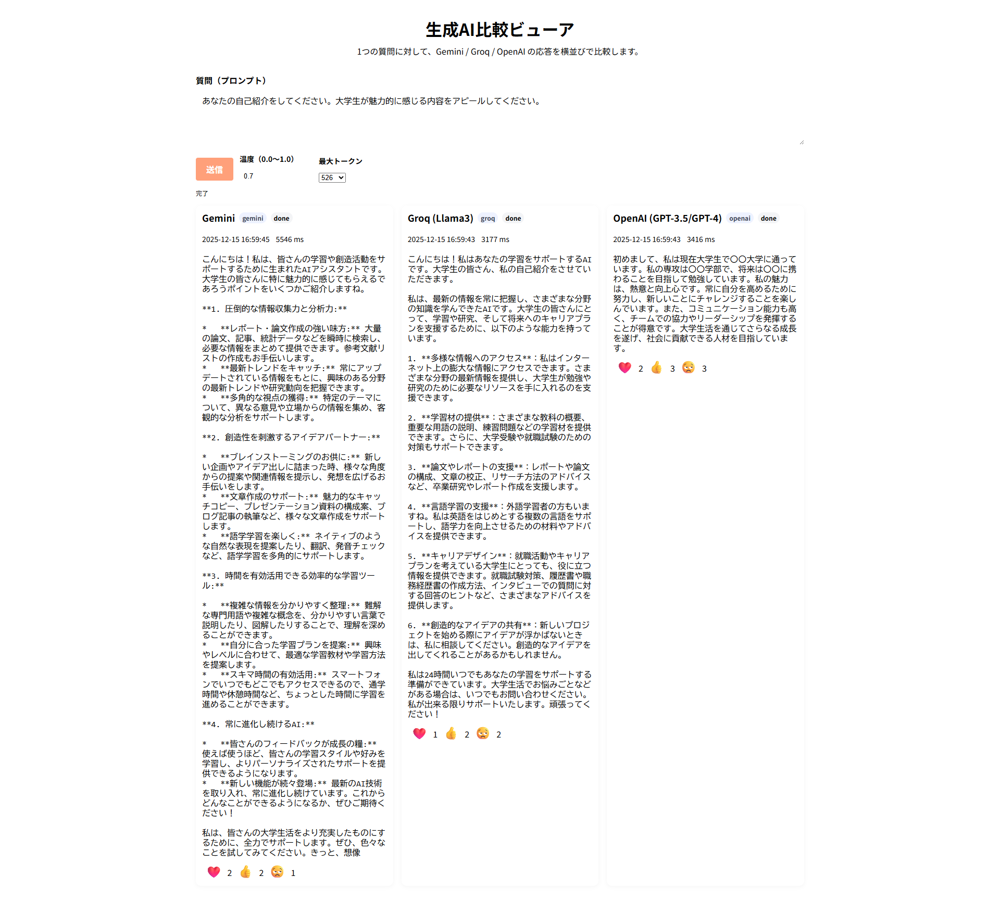
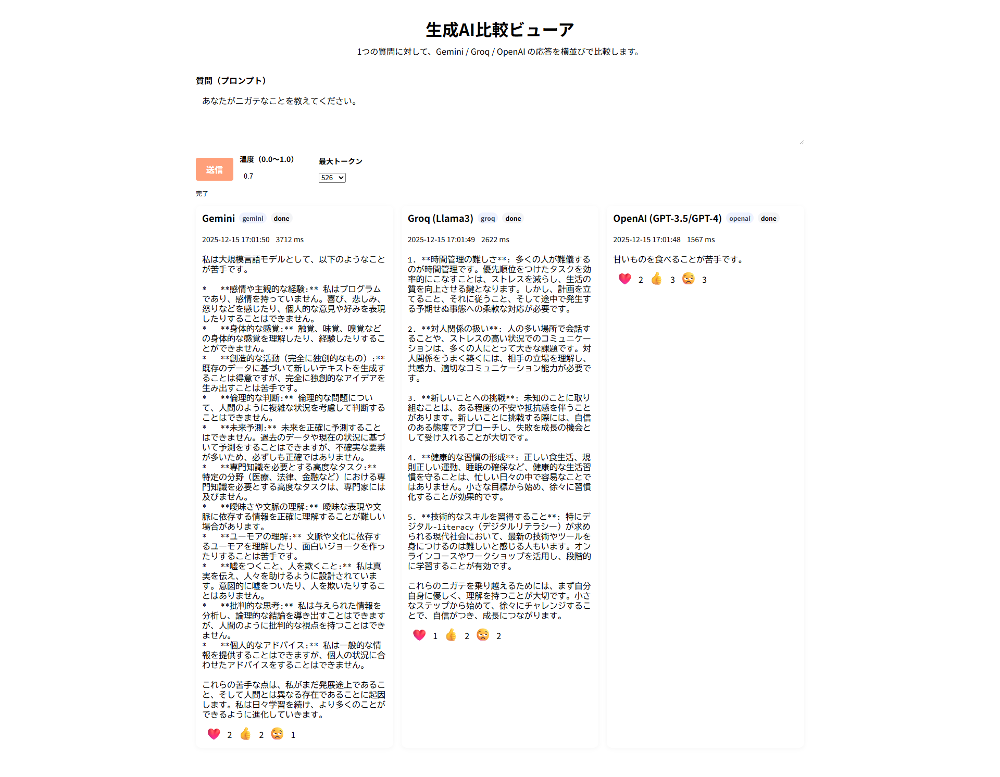

# 1. タイトル　　生成AI比較ビューア

## 2. 課題内容（どんな作品か）
- Gemini,Groq,OpenAIに同じ質問を投げてどのような回答が返ってくるかを比較するアプリです。
- 温度と使用トークン量を選択することができます。
- 返ってきた回答に対する好みをボタンで押しながら直感的な評価を蓄積していきます。

## 3. アプリのデプロイURL
- https://aratabplp-boop.github.io/Ai-app/

## 4. ログインID＆パスワード
-　なし

## 5. 工夫した点、こだわった点
- 1つの画面で、同じ質問に対する3つの生成AIの回答を同時比較できる。
- シンプルなデザインと構造。だけどインパクトがあるものを作りたかった。
- 直感的な評価とその蓄積。何度も質問を繰り返すことで、自身の嗜好にあった生成AIが見えてくる。

##　6.備考（備忘録）
- 生成AIをAPIでつなぐことは思ってたよりも簡単。でもトークン（課金）が心配
- Gemini-proは思考にトークンを大量消費するため、接続を断念
- 彼らの反応は、毎日違う傾向がある…気がする
- 生成AIとのAPI疎通のために図らずもバックエンドを作ることになってしまった。よくわかってない・・。

